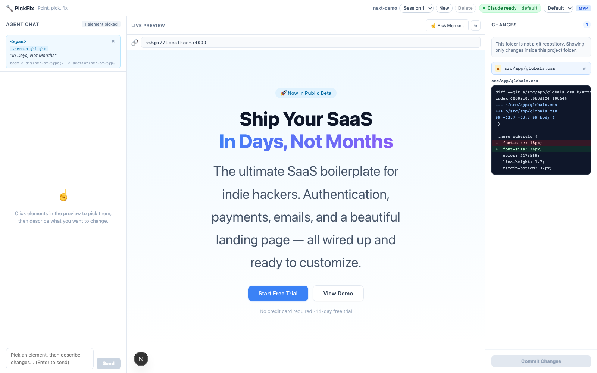
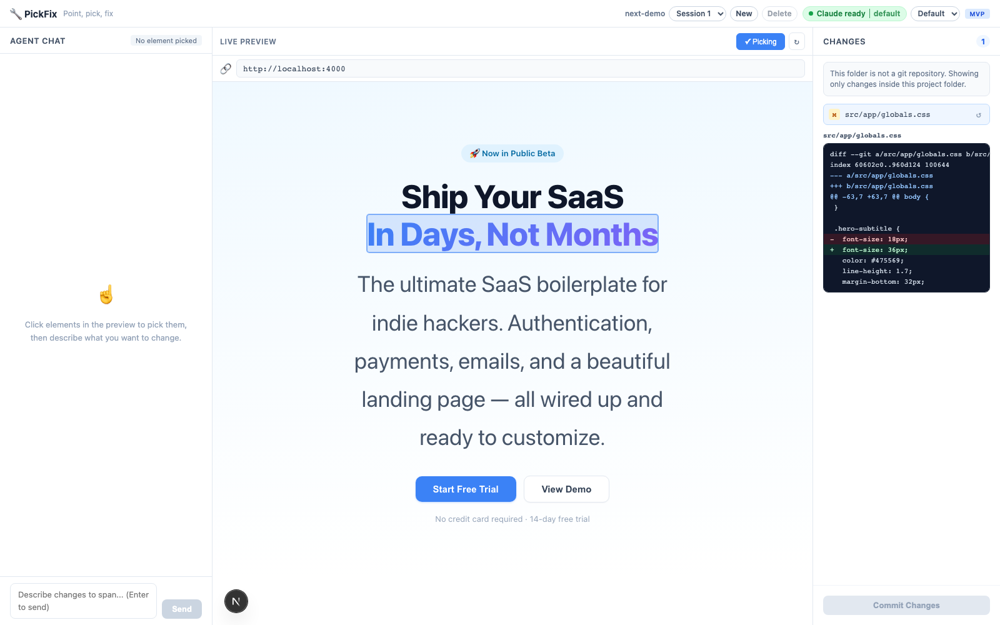
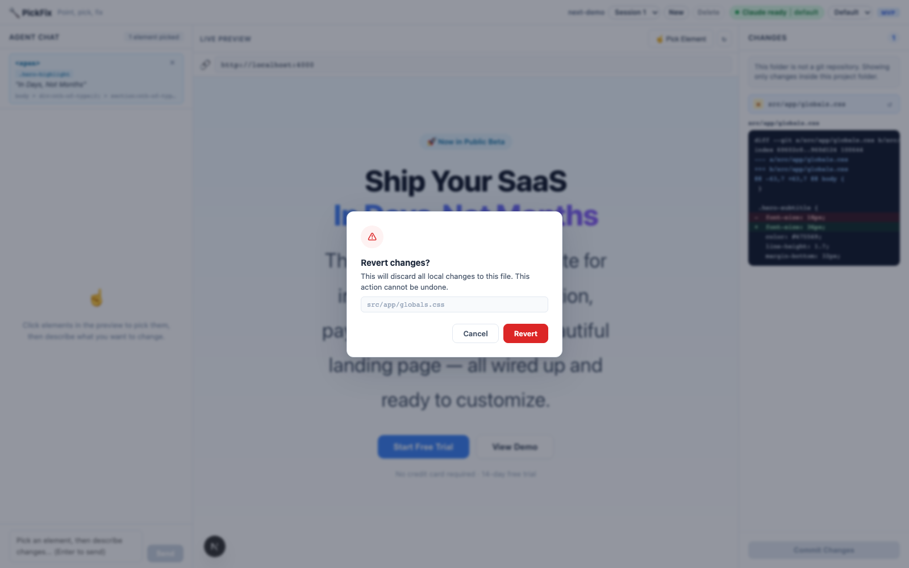

# PickFix

> Point, pick, fix — preview-driven development with AI.

PickFix lets you click an element in a live preview, describe the UI change you want, and let an AI coding agent edit the real source files. You can inspect the diff, keep iterating, or revert a file from the Changes panel.



## Quick start

Install dependencies:

```bash
pnpm install
```

Start PickFix with the bundled Next.js demo:

```bash
pnpm dev
```

Open:

```txt
http://localhost:3001
```

This starts three local services in order:

1. Target app on `5678`
2. PickFix proxy on `4000`
3. PickFix web UI on `3001`

## Try the flow

1. Open `http://localhost:3001`.
2. Click **Pick Element** in the Live Preview toolbar.
3. Click text, a button, or any visible UI element in the preview.
4. Ask for a small change, for example:

   ```txt
   Make this heading friendlier and slightly larger.
   ```

5. Watch the preview hot reload.
6. Review the changed files and diff in the Changes panel.
7. Revert an individual file if the change is not right.

## Use your own project

From the PickFix repo, point PickFix at any local app:

```bash
pnpm pickfix -- \
  --project /absolute/path/to/your-app \
  --dev 'pnpm dev --port 5678' \
  --port 5678
```

The `--dev` command should start your app on the same port passed to `--port`.

Next.js example:

```bash
pnpm pickfix -- \
  --project /Users/me/projects/my-next-app \
  --dev 'pnpm exec next dev -p 5678' \
  --port 5678
```

Nuxt example:

```bash
pnpm pickfix -- \
  --project /Users/me/projects/my-nuxt-app \
  --dev 'pnpm dev --port 5678' \
  --port 5678
```

If your dev server is already running:

```bash
pnpm pickfix -- \
  --project /absolute/path/to/your-app \
  --target http://localhost:5173 \
  --no-dev
```

## What it does today

- Runs an external target app without adding code to that app.
- Proxies the target app and injects a lightweight element-picking bridge.
- Sends selected element metadata to the agent: tag, classes, selector, text, bounds, and HTML hint.
- Lets a local Claude Code agent edit source files from the picked context.
- Shows changed files and diffs for the target project.
- Reverts individual changed files from the Changes panel.
- Persists chat history per target project across page refreshes.

PickFix is still an MVP. It is best suited for local experimentation and small UI edits.

## Screenshots

### Picking an element



Pick mode highlights the exact element in the proxied live preview.

### Reviewing and reverting changes



The Changes panel shows a diff preview and asks for confirmation before discarding a file's local edits.

## Why PickFix exists

UI work often starts with a visual target: “this button”, “that title”, “the card over here”. PickFix turns the live preview into the context picker, so the agent gets the element metadata it needs before editing code.

The goal is not to replace your editor or Git workflow. The goal is to make the first step of a UI change feel natural: point at the thing, say what you want, review the code.

## How it works

```txt
browser → PickFix web UI (:3001)
            ├── Agent Chat
            ├── Preview iframe → PickFix proxy (:4000) → target app (:5678)
            └── Changes panel → git status/diff for target project

proxy → intercepts HTML → injects /__pf/bridge.js
bridge → runs inside iframe → sends picked element metadata via postMessage
agent → runs in target project cwd → edits real source files
```

The target project does not need a PickFix dependency. PickFix starts your dev server, proxies it, injects the browser bridge at runtime, and runs the agent with the target project as its working directory.

## Requirements

- Node `~24`
- pnpm `10.33.2`
- Git available on your machine
- Claude Code CLI available as `claude` for agent edits

Check Claude Code availability:

```bash
claude --version
```

If your binary is not named `claude`, set:

```bash
export CLAUDE_BIN=/path/to/claude
```

Optional model selection:

```bash
export PF_CLAUDE_MODEL=sonnet
```

## Commands

```bash
# Start with the bundled Next.js demo
pnpm dev

# Start with the bundled Nuxt demo
pnpm dev:nuxt

# Typecheck all packages
pnpm typecheck

# Run tests
pnpm test

# Full validation
pnpm check
```

## Monorepo structure

```txt
pickfix/
├── apps/
│   └── web/          # Next.js UI: chat, preview, changes panel
├── packages/
│   ├── bridge/       # Injected element-picking bridge
│   ├── cli/          # Starts target → proxy → web
│   └── proxy/        # HTTP/WS proxy and bridge injection
└── examples/
    ├── next-demo/    # Example external Next.js app
    └── nuxt-demo/    # Example external Nuxt app
```

## Current limitations

- Agent quality depends on selected element metadata and prompt clarity.
- PickFix focuses on local development, not remote deployments.
- The Changes panel uses Git status/diff, so the target project should be inside a Git repository for the best experience.
- Branch/worktree management and source annotation are planned but not implemented yet.

## Roadmap

See [ROADMAP.md](./ROADMAP.md) for the project roadmap and candidate RFCs.

- [x] Live preview through proxy
- [x] Runtime bridge injection
- [x] Element picking
- [x] Agent chat
- [x] Changes panel with diff preview
- [x] Per-file revert from Changes
- [x] Per-project chat history
- [ ] Source annotation for better component/file mapping
- [ ] Branch/worktree workflow
- [ ] Commit/PR flow
- [ ] More framework adapters and examples

## Contributing

Issues and pull requests are welcome. See [CONTRIBUTING.md](./CONTRIBUTING.md) for the issue workflow, PR guidelines, and recommended labels.

## License

MIT
